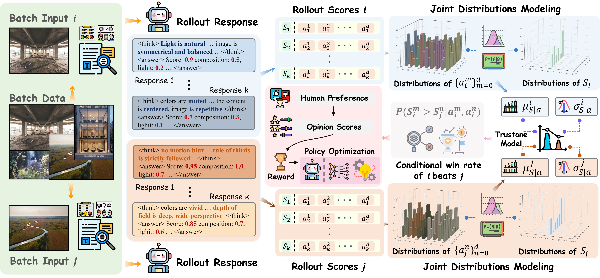
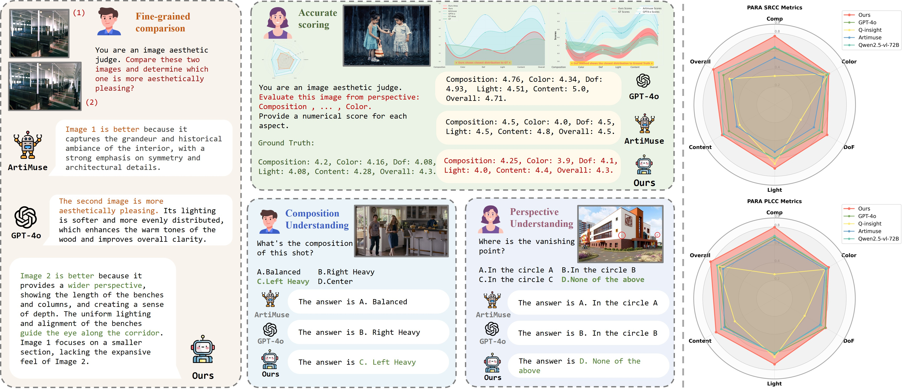

  <h1 align="center">[CVPR 2026]JoPPO: Hierarchical Photography Assessment via Contrastive Joint Conditional Probabilistic Reinforcement Learning</h1>
<!--   <h2 align="center">ICML 2024</h2> -->
  

[YiFan Yang*](https://openreview.net/profile?id=~Yifan_Yang37), [Juntuo Wang*](https://openreview.net/profile?id=~Juntuo_Wang1), [Yuming Qiao*](https://openreview.net/profile?id=~Yuming_Qiao1), [Xudong Zhang](https://openreview.net/profile?id=~Xudong_Zhang13), [Chunyang Yu](https://scholar.google.com/citations?user=0DtGoYMAAAAJ&hl=zh-CN), [Yan Li](https://openreview.net/profile?id=~Yan_Li21), [Xiao Lin](https://openreview.net/profile?id=~Xiao_Lin5), [Liang Luo](https://openreview.net/profile?id=~Liang_Luo4)✉, [Dan Meng](https://openreview.net/profile?id=~Dan_Meng2)✉  

## 📃 Abstract
With the advancement of Vision-Language Models (VLMs), employing VLM-as-a-Judge for visual evaluation has become a widely adopted metric. However, existing VLM-as-a-Judge approaches suffer from biased scoring with low discrimination and lack the capacity for unified multi-attribute compositional assessment. To address these limitations, we propose JoPPO (<b>Jo</b>int <b>P</b>robabilistic <b>P</b>olicy <b>O</b>ptimization) that enables the VLMs to learn ranking under compositional assessment constraints. We evaluate the JoPPO on image aesthetics as a testbed, a task requiring nuanced understanding of multiple attributes including composition, lighting, color and geometry. Training follows two stages: (1) Supervised Fine-Tuning (SFT) on synthetic composition dataset provided by automated data generation pipeline to instill compositional priors; and (2) Contrastive Joint Conditional Probabilistic Reinforcement Learning: we introduce JoPPO, which compute reward based on the expected win rate of total scores derived from the conditional distribution of fine-grained attribute scores within batches, effectively enhancing the model’s discriminative ability in composite evaluation. Across aesthetic benchmarks, our method achieves consistent improvements in ranking consistency, demonstrating strong zero-shot generalization.  

## 🧭 Overview

We propose a joint conditional probability optimization algorithm built upon the GRPO framework. Without requiring explicit supervision for individual attribute scores, our method jointly models and optimizes both dimension-level and overall image aesthetic quality, thereby enhancing the interpretability and consistency of the model's aesthetic judgments.

## 🎨 Updates
  - 🔥 **`2025/02/24`**: Our **JoPPO paper** is accepted by <b>CVPR 2026</b>.

## 🌏 Code Release
Thank you all for your attention. We are actively cleaning our code and will open source the inference code soon.

    
## 🖊 Acknowledgement
We sincerely thank the authors and contributors of [visualquality-r1](https://github.com/tianhewu/visualquality-r1) and [Q-Insight](https://github.com/bytedance/Q-Insight) for their inspiring open-source efforts, which have provided valuable references for our project.